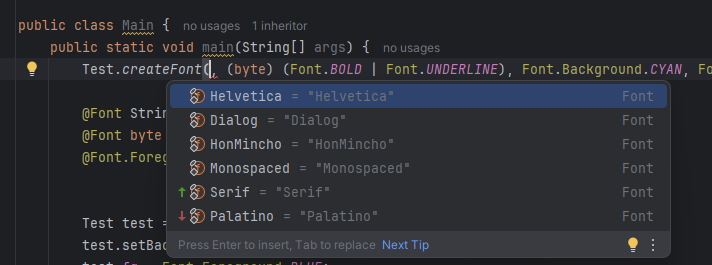
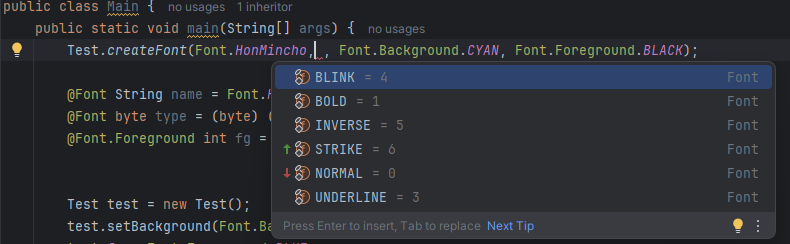
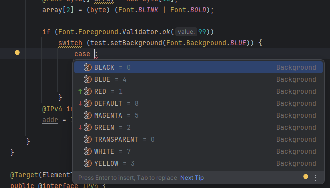
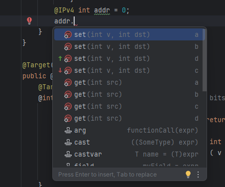
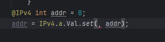
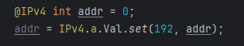

# SlimEnum + SlimStruct

<!-- Plugin description -->
Java's value-type story is threadbare. Enums allocate; bit-packed primitives are invisible to the IDE. This plugin closes both gaps without asking the
runtime to change.

**SlimEnum** turns an `@interface` of primitive or `String` constants into a type-bound set. At every site annotated with it — variable, field,
parameter, return type — IntelliJ offers completion restricted to that exact set.

**SlimStruct** turns an `@interface` that nests further `@interface`s (each exposing `get`/`set` static accessors) into a named record living entirely
inside a single `byte`, `char`, `short`, `int`, or `long`. Packs propagate implicitly through assignments and casts. Dot-access on a packed variable
lists every field's accessor as a completion; picking one rewrites `pack.` into a fully qualified `Struct.field.Val.get(pack)` call, then collapses
the prefix against existing imports.

Both features exist entirely in the IDE. The emitted bytecode is always plain primitives — zero allocation, zero indirection, zero runtime magic.
<!-- Plugin description end -->

The two features address different problems. Skip to whichever applies:

- **[SlimEnum](#slimenum--type-bound-constant-sets)** — you're tired of `enum` objects and want primitive constants with the editor experience of
  enums.
- **[SlimStruct](#slimstruct--packed-records-as-opaque-types)** — you want C#-`struct`-style named value records, but Java has no `struct`, no opaque
  types, and no value classes.

---

## SlimEnum — type-bound constant sets

### 1. Declare a SlimEnum annotation

Create an `@interface` and put `static final` constants of the same primitive type (or `String`) inside it. Nest annotations to group related sets.

```java
@interface Font {
	// byte constants — treated as FLAGS (see "Enum vs flag" below)
	byte NORMAL       = 0,
			BOLD      = 1,
			UNDERLINE = 3,
			BLINK     = 4,
			INVERSE   = 5,
			STRIKE    = 6;
	
	// String constants — always treated as enum-like (mutually exclusive)
	String Helvetica   = "Helvetica",
			Palatino   = "Palatino",
			HonMincho  = "HonMincho",
			Serif      = "Serif",
			Monospaced = "Monospaced",
			Dialog     = "Dialog";
	
	@interface Foreground {
		// first two names "RED" > "BLACK" → FLAG-style completion
		int RED         = 1,
				BLACK   = 0,
				GREEN   = 2,
				YELLOW  = 3,
				BLUE    = 4,
				MAGENTA = 5,
				CYAN    = 6,
				WHITE   = 7,
				DEFAULT = 8;
		
		// a plain utility class can live inside the annotation
		class Validator {
			public static boolean ok( int value ) {
				switch( value ) {
					case BLACK: case RED: case GREEN: case YELLOW:
					case BLUE: case MAGENTA: case CYAN: case WHITE:
					case DEFAULT:
						return true;
				}
				return false;
			}
		}
	}
	
	@interface Background {
		// first two names "BLACK" < "RED" → ENUM-style completion
		int BLACK           = 0,
				RED         = 1,
				GREEN       = 2,
				YELLOW      = 3,
				BLUE        = 4,
				MAGENTA     = 5,
				CYAN        = 6,
				WHITE       = 7,
				DEFAULT     = 8,
				TRANSPARENT = 0; // aliases are fine — values don't have to be unique
	}
}
```

### 2. Enum vs flag behaviour

SlimEnum picks an exclusion policy for its completion popup from the **alphabetical order of the first two declared constant names** — nothing else.
It never looks at the values.

| First two names               | Treated as | What completion filters out                                   |
|-------------------------------|------------|---------------------------------------------------------------|
| `A, B` (alphabetical order)   | **enum**   | constants already used as `case` labels in the same `switch`  |
| `B, A` (any non-alphabetical) | **flags**  | constants already OR-ed (`\|`) into the current expression    |
| any order, `String` type      | **enum**   | same as enum above — non-primitive types are always enum-like |

### 3. Apply the annotation and use the completion

```java
class Test {
	@Font            String name;
	@Font.Foreground int    fg;
	
	@Font.Background int setBackground( @Font.Background int bg ) { return bg; }
	
	static void createFont( @Font String name,
	                        @Font byte style,
	                        @Font.Background int background,
	                        @Font.Foreground int foreground ) { }
}
```

At every position whose type is covered by a SlimEnum annotation, completion lists exactly the matching constants — qualified, type-filtered, and
policy-aware.


second argument



in a switch case


---

## SlimStruct — packed records as opaque types

### The heap problem with small objects

Every non-primitive in Java lives on the heap. A `Point { int x, y }` is 16–24 bytes of object header plus 8 bytes of data, reached through a pointer.
Scale to millions:

- **2–3× the memory** the raw data actually needs;
- **GC pressure** proportional to population;
- **Cache misses** on every iteration — each field read chases a pointer.

For dense simulation state, packet headers, permission masks, or grid coordinates, the overhead dwarfs the payload.

### How other languages solve it

| Language  | Construct                                                                                     | Guaranteed unboxed?                                        |
|-----------|-----------------------------------------------------------------------------------------------|------------------------------------------------------------|
| C#        | [`struct`](https://learn.microsoft.com/dotnet/csharp/language-reference/builtin-types/struct) | yes — stack or inline in arrays                            |
| Scala 3   | [opaque type](https://docs.scala-lang.org/scala3/book/types-opaque-types.html)                | **yes — always**                                           |
| Scala 2/3 | [value class](https://docs.scala.org/overviews/core/value-classes.html)                       | no — boxes in `Any` slots, arrays, generics, pattern match |
| Kotlin    | [inline / value class](https://kotlinlang.org/docs/inline-classes.html)                       | usually — boxes in generics and nullable contexts          |
| Rust / Go | native `struct`                                                                               | yes                                                        |

The sharpest line is drawn by Scala 3, between *opaque types* and *value classes*:

> An **opaque type** is always just the underlying type at runtime. There is no wrapper class at all, so there is no scenario — generics, arrays,
> pattern matching, `Any`-typed slots — where boxing can sneak in.
>
> A **value class** *may* box. The compiler inserts a wrapper as soon as you put the value somewhere polymorphism is required. The zero-allocation
> guarantee only holds in monomorphic code paths.

Java offers neither. [Project Valhalla](https://openjdk.org/projects/valhalla/) intends to eventually deliver value classes to the platform, but
nothing has landed in any current LTS — see the
running [state-of-Valhalla document](https://openjdk.org/projects/valhalla/design-notes/state-of-valhalla/01-background) for the scope of what Java
still lacks today.

### How Java can do it today — and why nobody does

A Java primitive holds up to **64 bits**. That is enough for:

- nine Unix permission flags in a `short` (16 bits)
- four IPv4 octets in an `int` (32 bits)
- a 40-bit timestamp + 8-bit event type + 16-bit sequence in a `long` (64 bits)
- 64 independent booleans in a single `long`

The layout is just bit masks and shifts. Zero allocation, zero indirection, the value is literally the primitive — matching Scala 3 opaque types'
guarantee, not Scala 2 value classes' "sometimes boxes" one.

Writing it by hand, however, is miserable:

- `mode |= 0x40` tells the IDE nothing — no completion, no field name, no range check.
- `(mode >>> 16) & 0xFF` looks identical regardless of *which* field you meant.
- Bit-layout mistakes compile silently and surface as corrupt data at runtime.
- Refactoring a bit offset means visiting every call site, blind.

The savings are real. The maintenance burden is why the pattern rarely leaves hot-path libraries that can afford a dedicated maintainer.

### A naive first attempt — plain `interface` with static accessors

The obvious cleanup is to give each field's bit codec a name. Wrap the four IPv4 octets in a plain Java `interface` with `static` `get` / `set`
methods:

```java
public interface IPv4 {
    interface a {                                   // bits 24..31
        static int get(int src)        { return (src >>> 24) & 0xFF; }
        static int set(int v, int dst) { return dst & ~(0xFF << 24) | (v & 0xFF) << 24; }
    }
    interface b {                                   // bits 16..23
        static int get(int src)        { return (src >>> 16) & 0xFF; }
        static int set(int v, int dst) { return dst & ~(0xFF << 16) | (v & 0xFF) << 16; }
    }
    interface c {                                   // bits 8..15
        static int get(int src)        { return (src >>> 8) & 0xFF; }
        static int set(int v, int dst) { return dst & ~(0xFF << 8) | (v & 0xFF) << 8; }
    }
    interface d {                                   // bits 0..7
        static int get(int src)        { return src & 0xFF; }
        static int set(int v, int dst) { return dst & ~0xFF | (v & 0xFF); }
    }
}
```

Call site:

```java
int addr = 0;
addr = IPv4.a.set(192, addr);
addr = IPv4.b.set(168, addr);
addr = IPv4.c.set(1, addr);
addr = IPv4.d.set(1, addr);
```

Each `set` returns the updated pack, so the same address can also be built in a single expression — the calls nest from the innermost field outward:

```java
int addr = IPv4.a.set(192, IPv4.b.set(168, IPv4.c.set(1, IPv4.d.set(1, 0))));
```

Progress — named fields, reviewable bit codecs, a searchable namespace. But the IDE still has nothing useful to work with:

- `addr` is just an `int`. There is no type-level link between `addr` and `IPv4`, so typing `addr.` offers nothing but `Integer`'s inherited static
  methods.
- Passing `addr` to a `void send(int sequenceNumber)` method compiles without complaint — an IP address and a sequence number look identical to the
  compiler.
- Any other `int` in scope can be handed to `IPv4.a.set` as if it were a pack.
- To *discover* `IPv4.a.set`, `IPv4.b.set`, and friends you must remember the class name, type `IPv4.`, and walk the nested-type tree by hand. No
  dot-access on the value itself, no type-narrowed completion, no propagation through assignments.

You have traded one problem (opaque bit masks) for another (correct-by-construction names, but no type distinction from any other `int`). Stock Java
has no syntactic hook that lets an `int` *carry* a type identity like `@IPv4`.

Except…

### What this plugin contributes

The insight is that Java **does** have a type-level marker that attaches to a primitive without changing its representation: a `@Target(TYPE_USE)`
annotation. An `@IPv4 int` is, to the JVM, just an `int` — but to the source, it is a distinct type-use. If the IDE is taught to read that annotation
as "the shape of this pack", every ergonomics problem above dissolves at tool level while the runtime stays as thin as the naive approach.

So, structurally: keep the naive `interface IPv4 { interface a { static … } … }` shape — but promote the outer to an `@interface` and tag every
pack-typed slot with it. Put the field accessors on an inner interface (canonically named `Val`) inside each field's nested `@interface`, and have
each accessor take `@IPv4 int` for its pack parameter. That turns the declaration from "a namespace for codec functions" into "a named opaque type the
IDE understands". Optional `hasValue` / `to_null` methods next to `get` / `set` promote a field to nullable. A nested `@interface Nullable` lifts the
whole pack into an optional form.

With the plugin installed, the IDE treats that annotation as a distinct, field-addressable type:

- **Dot-access** on a `@FilePerm short` or `@IPv4 int` lists every field's accessors in the completion popup.
- **Picking one** rewrites `pack.xxx` into `Struct.field.Val.xxx(pack, …)`, with FQN prefixes auto-shortened against the file's imports.
- **Annotation propagation** flows through assignments, casts, returns, and ternaries — `short s = perm;` still shows the `FilePerm` accessors on `s`,
  file-wide.
- **`@<Struct>.Nullable`** wrappers surface a separate completion set that steers you through `hasValue` → `get` before you can unwrap.

You pay the one-time cost of declaring the codec; the IDE picks up the rest. The runtime pays nothing at all.

Declare the layout as an `@interface` carrying nested `@interface`s. Each nested annotation is one **field**; inside it an inner interface named `Val`
holds `static` `get` / `set` — plus optional `hasValue` / `to_null` for nullable fields — implementing the bit-level codec. The outer annotation and
every pack-typed parameter carry `@Target(TYPE_USE)`, so they annotate the type rather than the declaration. At runtime everything is still just the
primitive.

With the plugin installed, the IDE treats that annotation as a distinct, field-addressable type:

- **Dot-access** on a `@FilePerm short` or `@IPv4 int` lists every field's accessors in the completion popup.
- **Picking one** rewrites `pack.xxx` into `Struct.field.Val.xxx(pack, …)`, with FQN prefixes auto-shortened against the file's imports.
- **Annotation propagation** flows through assignments, casts, returns, and ternaries — `short s = perm;` still shows the `FilePerm` accessors on `s`,
  file-wide.
- **`@<Struct>.Nullable`** wrappers surface a separate completion set that steers you through `hasValue` → `get` before you can unwrap.

You pay the one-time cost of declaring the codec; the IDE picks up the rest. The runtime pays nothing at all.

Every example below starts with the stock **C#** form a language with value types would write — then shows the equivalent SlimStruct in **Java**.

### Example 1 — Unix file permissions (9 booleans in a `short`)

The classic `rwx` for owner, group, and other.

**C#:**

```csharp
public struct FilePerm {
    bool ownerRead,  ownerWrite,  ownerExec;
    bool groupRead,  groupWrite,  groupExec;
    bool otherRead,  otherWrite,  otherExec;
}
```

**Java** — nine boolean fields, one bit each, packed into a `short`:

```java
@Target( ElementType.TYPE_USE )
public @interface FilePerm {
	@Target( ElementType.TYPE_USE )
	@interface ownerRead {                 // bit 0
		interface Val {
			static boolean get( @FilePerm short src ) { return ( src & ( 1 << 0 ) ) != 0; }
			
			static @FilePerm short set( boolean v, @FilePerm short dst ) {
				return ( short ) ( v ?
				                   dst | ( 1 << 0 ) :
				                   dst & ~( 1 << 0 ) );
			}
		}
	}
	
	@Target( ElementType.TYPE_USE )
	@interface ownerWrite {                // bit 1
		interface Val {
			static boolean get( @FilePerm short src ) { return ( src & ( 1 << 1 ) ) != 0; }
			
			static @FilePerm short set( boolean v, @FilePerm short dst ) {
				return ( short ) ( v ?
				                   dst | ( 1 << 1 ) :
				                   dst & ~( 1 << 1 ) );
			}
		}
	}
	// ... ownerExec (bit 2), groupRead (3), groupWrite (4),
	//     groupExec (5), otherRead (6), otherWrite (7), otherExec (8)
}
```

Call site:

```java
@FilePerm short perm = 0;
perm = FilePerm.ownerRead.Val.set(true, perm);
perm = FilePerm.ownerWrite.Val.set(true, perm);
perm = FilePerm.groupRead.Val.set(true, perm);
perm = FilePerm.otherRead.Val.set(true, perm);

if (FilePerm.ownerWrite.Val.get(perm) && !FilePerm.otherWrite.Val.get(perm)) {
    // owner can modify, others cannot
}
```

A million permission records live in a `short[]` — 2 MB, contiguous, cache-friendly, zero allocation per element.

> Need 64 booleans instead of 9? Keep the same field shape, scale up to bit 63, use a `long` as the carrier. Each extra flag costs one bit and four
> lines of codec.

### Example 2 — IPv4 address (4 bytes in an `int`)

**C#:**

```csharp
public struct IPv4 {
    byte a, b, c, d;    // 192.168.1.1 → a=192, b=168, c=1, d=1
}
```

**Java** — four octets packed into a single `int`, most-significant-octet first:

```java
@Target( ElementType.TYPE_USE )
public @interface IPv4 {
	@Target( ElementType.TYPE_USE )
	@interface a {                          // bits 24..31
		interface Val {
			static int get( @IPv4 int src ) { return ( src >>> 24 ) & 0xFF; }
			
			static @IPv4 int set( int v, @IPv4 int dst ) {
				return dst & ~( 0xFF << 24 ) | ( v & 0xFF ) << 24;
			}
		}
	}
	
	@Target( ElementType.TYPE_USE )
	@interface b {                          // bits 16..23
		interface Val {
			static int get( @IPv4 int src ) { return ( src >>> 16 ) & 0xFF; }
			
			static @IPv4 int set( int v, @IPv4 int dst ) {
				return dst & ~( 0xFF << 16 ) | ( v & 0xFF ) << 16;
			}
		}
	}
	
	@Target( ElementType.TYPE_USE )
	@interface c {                          // bits 8..15
		interface Val {
			static int get( @IPv4 int src ) { return ( src >>> 8 ) & 0xFF; }
			
			static @IPv4 int set( int v, @IPv4 int dst ) {
				return dst & ~( 0xFF << 8 ) | ( v & 0xFF ) << 8;
			}
		}
	}
	
	@Target( ElementType.TYPE_USE )
	@interface d {                          // bits 0..7
		interface Val {
			static int get( @IPv4 int src ) { return src & 0xFF; }
			
			static @IPv4 int set( int v, @IPv4 int dst ) {
				return dst & ~0xFF | v & 0xFF;
			}
		}
	}
}
```
and now, with plugin we have



after completion



at the caret position type the value (192) and you're done.



Call site:

```java
@IPv4 int addr = 0;
addr = IPv4.a.Val.set(192, addr);
addr = IPv4.b.Val.set(168, addr);
addr = IPv4.c.Val.set(1, addr);
addr = IPv4.d.Val.set(1, addr);

System.out.printf("%d.%d.%d.%d%n",
    IPv4.a.Val.get(addr), IPv4.b.Val.get(addr),
    IPv4.c.Val.get(addr), IPv4.d.Val.get(addr));
```

Storing a million addresses costs 4 MB as an `int[]` instead of the ~40 MB a class-based representation would cost, and iteration hits L1 cache the
whole way.

### Example 3 — mixed-width fields (audit event packing a full `long`)

**C#:**

```csharp
public struct AuditEvent {
    long  timestampMs;    // 40 bits — ~34 years of millisecond precision
    byte  kind;           //  8 bits — event type ordinal
    short sequence;       // 16 bits — per-session counter
}
```

**Java** — three differently-sized fields packed edge-to-edge in a single `long`:

```java
@Target( ElementType.TYPE_USE )
public @interface AuditEvent {
	@Target( ElementType.TYPE_USE )
	@interface timestampMs {                // bits 0..39
		interface Val {
			static long get( @AuditEvent long src ) { return src & 0xFF_FFFF_FFFFL; }
			
			static @AuditEvent long set( long v, @AuditEvent long dst ) {
				return dst & ~0xFF_FFFF_FFFFL | v & 0xFF_FFFF_FFFFL;
			}
		}
	}
	
	@Target( ElementType.TYPE_USE )
	@interface kind {                       // bits 40..47
		interface Val {
			static int get( @AuditEvent long src ) { return ( int ) ( ( src >>> 40 ) & 0xFFL ); }
			
			static @AuditEvent long set( int v, @AuditEvent long dst ) {
				return dst & ~( 0xFFL << 40 ) | ( ( long ) v & 0xFFL ) << 40;
			}
		}
	}
	
	@Target( ElementType.TYPE_USE )
	@interface sequence {                   // bits 48..63
		interface Val {
			static int get( @AuditEvent long src ) { return ( int ) ( ( src >>> 48 ) & 0xFFFFL ); }
			
			static @AuditEvent long set( int v, @AuditEvent long dst ) {
				return dst & ~( 0xFFFFL << 48 ) | ( ( long ) v & 0xFFFFL ) << 48;
			}
		}
	}
}
```

Billions of events fit in a `long[]`. Three bit-ops retrieve any field.

### Example 4 — per-field nullability (a 3-state boolean)

A Boolean with a third "undecided" state needs 2 bits, not 1. Real-world cases: a cookie-consent flag that defaults to "ask", a feature toggle that a
user hasn't touched yet, a survey answer that can be skipped.

**C#:**

```csharp
public struct UserChoice {
    bool? subscribed;       // null / true / false — 2 bits
    bool  acknowledged;     // true / false        — 1 bit
}
```

The nullable boolean uses three of the four available 2-bit states:

| bits   | meaning  |
|--------|----------|
| `0b00` | `false`  |
| `0b01` | `true`   |
| `0b10` | `null`   |
| `0b11` | *unused* |

**Java** — the 2-bit field's `Val` gains `hasValue` and `to_null` alongside the usual `get`/`set`:

```java
@Target( ElementType.TYPE_USE )
public @interface UserChoice {
	@Target( ElementType.TYPE_USE )
	@interface subscribed {               // bits 0..1 — 0=false, 1=true, 2=null
		interface Val {
			static boolean get( @UserChoice byte src ) {
				return ( src & 0x3 ) == 0x1;
			}
			
			static @UserChoice byte set( boolean v, @UserChoice byte dst ) {
				return ( byte ) ( dst & ~0x3 | ( v ?
				                                 0x1 :
				                                 0x0 ) );
			}
			
			static boolean hasValue( @UserChoice byte src ) {
				return ( src & 0x3 ) != 0x2;
			}
			
			static @UserChoice byte to_null( @UserChoice byte dst ) {
				return ( byte ) ( dst & ~0x3 | 0x2 );
			}
		}
	}
	
	@Target( ElementType.TYPE_USE )
	@interface acknowledged {             // bit 2
		interface Val {
			static boolean get( @UserChoice byte src ) {
				return ( src & 0x4 ) != 0;
			}
			
			static @UserChoice byte set( boolean v, @UserChoice byte dst ) {
				return ( byte ) ( v ?
				                  dst | 0x4 :
				                  dst & ~0x4 );
			}
		}
	}
}
```

Call site — start from zero (both fields `false`), or immediately push `subscribed` to `null` with `to_null`:

```java
@UserChoice byte choice = UserChoice.subscribed.Val.to_null((byte) 0);

if (!UserChoice.subscribed.Val.hasValue(choice)) {
    choice = UserChoice.subscribed.Val.set(askUser(), choice);
}
choice = UserChoice.acknowledged.Val.set(true, choice);

if (UserChoice.subscribed.Val.hasValue(choice) &&
    UserChoice.subscribed.Val.get(choice)) {
    sendNewsletter();
}
```

Typing `choice.` pops up every relevant accessor — including both `hasValue` and `get` for the nullable field, so you can't accidentally `get` before
checking `hasValue`: both are right there in the list.

### Example 5 — whole-pack `Nullable` wrapper (an optional IPv4)

Sometimes the pack itself may be absent: a config entry that might not be set, a DNS lookup that failed, a slot in a cache.

**C#:**

```csharp
public struct MaybeAddress {
    IPv4? value;      // an IPv4 address, or nothing
}
```

**Java** — nest a `@Nullable` annotation inside `IPv4`, using a sentinel value outside the payload's meaningful range. Here we reserve
`255.255.255.255` as "no address":

```java
@Target( ElementType.TYPE_USE )
public @interface IPv4 {
	// ... the four octet fields shown above ...
	
	@Target( ElementType.TYPE_USE )
	@interface Nullable {
		interface Val {
			static boolean hasValue( @Nullable int src ) { return src != NULL; }
			
			static @IPv4 int get( @Nullable int src )    { return src; }
			
			static @Nullable int set( @IPv4 int src )    { return src; }
			
			static @Nullable int to_null()               { return NULL; }
		}
		
		@Nullable int NULL = 0xFFFF_FFFF;             // sentinel: 255.255.255.255
	}
}
```

Usage:

```java
@IPv4.Nullable int maybe = IPv4.Nullable.Val.to_null();

if (IPv4.Nullable.Val.hasValue(maybe)) {
    @IPv4 int addr = IPv4.Nullable.Val.get(maybe);
    // use addr ...
}

@IPv4 int home = 0;
home = IPv4.a.Val.set(127, home);
home = IPv4.d.Val.set(1, home);
@IPv4.Nullable int lifted = IPv4.Nullable.Val.set(home);
```

`@IPv4` and `@IPv4.Nullable` are distinct types to the plugin. On an `@IPv4 int`, dot-completion offers every octet accessor **plus**
`Nullable.Val.set(pack)` to lift. On an `@IPv4.Nullable int`, dot-completion offers only the wrapper's readers (`hasValue`, `get`), steering you
through the correct unwrap sequence.

---

## What the plugin contributes

### 1. Dot-access offers every field accessor

Type `perm.` on a `@FilePerm short perm` and the popup lists every static method in every field's `Val` interface: `ownerRead.Val.get`,
`ownerRead.Val.set`, `ownerWrite.Val.get`, and so on. On an `@IPv4 int`, you see `a.Val.get`, `b.Val.set`, etc. Labels are the short method names; the
type-text column shows the field; the tail text shows the parameter signature.

Picking `set` of `a` rewrites the expression to

```java
IPv4.a.Val.set(<caret>, addr )
```

with the caret in the value slot. `JavaCodeStyleManager.shortenClassReferences` collapses the `IPv4.` prefix against existing imports.

### 2. Annotation propagation across assignments

Declare `int x = addr;` — the plugin remembers `x` is effectively `@IPv4 int`. Dot-access on `x` offers the same accessors as `addr`. This propagates
transitively through:

- initializers and reassignments of local variables;
- method returns (if the method's return type is annotated);
- casts (`(int) x`) and parenthesised expressions;
- ternary operands (`cond ? a : b`);
- field write sites within the same file.

Analysis uses `ReferencesSearch` over the enclosing method (for locals) or file (for fields), so it stays fast enough to run on every keystroke.

### 3. Nullable-wrapper completions adapt to the exact annotation

- On `@IPv4 int addr` — offers field accessors and `Nullable.Val.set(addr)` (lift).
- On `@IPv4.Nullable int maybe` — offers only `Nullable.Val.hasValue(maybe)` and `.get(maybe)`.

The plugin distinguishes them by the exact annotation class on each method's parameter, not by a name heuristic. Both views never leak into each
other.

### 4. Cross-struct value slots compose with SlimEnum

When a setter's value parameter is itself a SlimEnum-annotated type (e.g. `set(@EventKind int kind, @AuditEvent long dst)`), the plugin inserts
`pack.set(<caret>, pack)` with the caret at the value. SlimEnum then offers the valid `@EventKind` constants at that caret position. The two features
compose transparently.

### 5. Default Java completion is suppressed only when the plugin actually contributes

The contributor registers with `order="first"` and calls `result.stopHere()` only when it has emitted items. At a SlimStruct site, default Java
completion is suppressed — so you don't wade through every local variable to find your accessor. Anywhere else the plugin stays silent, and default
completion runs untouched.

---

## The philosophy

**Java the language, unmodified, cannot express any of this.** No `struct`, no opaque types, no value classes with a guaranteed-unboxed
representation, no user-defined primitives. Project Valhalla will eventually deliver something resembling this, but not on your current LTS.

SlimEnum + SlimStruct gives you the ergonomics of named, typed, field-addressable value aggregates **today**:

- **Zero runtime cost.** Bytecode is literally primitives. No wrapping, no boxing under arrays or generics, no hidden allocations. Matches Scala 3
  opaque types' guarantee — not Scala 2 value classes' "sometimes boxes" guarantee.
- **Tool-side only.** Nothing for downstream consumers of your API to install; they see plain Java annotations they can safely ignore.
- **Works with any Java version.** No preview flags, no compiler plugins, no agent, no bytecode rewriting.
- **Composes with existing Java idioms.** Packs are primitives — they fit in `int[]`, `long[]`, `Map<Long, Long>`,
  `ConcurrentHashMap.computeIfAbsent`, varargs, anywhere you already use primitives.

You are not extending Java the language. You are extending Java **the IDE experience** — which, for most real-world development, is the part that
decides whether a pattern is actually usable.

---

## Installation

**From the JetBrains Marketplace**

1. Open `Settings / Preferences` → `Plugins`.
2. Go to the `Marketplace` tab.
3. Search for **SlimEnum** and click `Install`.
4. Restart the IDE if prompted.

**From a local ZIP**

1. Download the [latest release](https://github.com/cheblin/SlimEnum/releases/latest).
2. Open `Settings / Preferences` → `Plugins`.
3. Click the gear icon → `Install plugin from disk…`.
4. Select the downloaded ZIP and restart when prompted.
